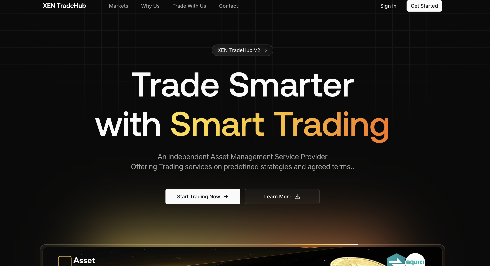

# XEN TradeHub Documentation

XEN TradeHub is an independent asset management service provider focused on structured trading support, transparent execution oversight, and disciplined market participation.

This documentation set is written for engineering, operations, and leadership stakeholders.

## At A Glance

| Area | Summary |
| --- | --- |
| Positioning | Trade Smarter with Smart Trading |
| Core Markets | Gold, Crypto, Forex, Commodities |
| Delivery Model | Client-owned broker accounts with strategy-led support |
| Platform Scope | Marketing website, admin portal, enquiries operations, analytics |

## Homepage Hero Reference

<!-- To avoid broken links on GitHub, keep the hero screenshot in this repository at `docs/images/homepage-hero.png`. -->

If you do not yet have the file in this path, add the attached screenshot from your local machine and commit it.

## Documentation Index

- [Development Guide](./DEVELOPMENT.md)
- [Production Operations Guide](./PRODUCTION.md)

## Technology Profile

- Next.js 14 (App Router)
- TypeScript + React 18
- Tailwind CSS + shadcn/ui
- Prisma ORM
- Clerk authentication
- API-driven admin operations

## Operational Guidance

- Admin workflows are designed for scale (high-volume enquiries, broker ordering, role governance).
- Update documentation when changing API contracts, middleware behavior, or environment configuration.
